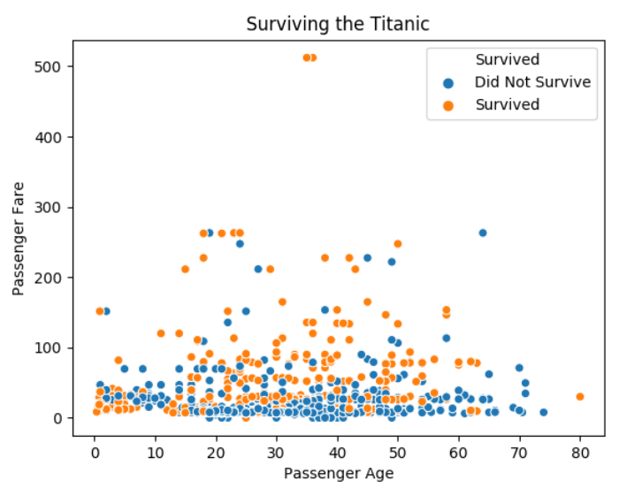

# titanic-survival

A Python 3 program using the libraries numpy, matplotlib, seaborn and pandas. The program reads a csv file and creates a scatterplot to visualize the data comparing the age of a passenger to the fare that the passenger paid on the Titanic.

https://repl.it/@chaudhryna/310-L7-Soft-Displaying-Titanic-Datasets-Starter

